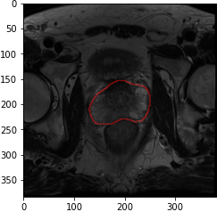

# ML_assesment

Paper 1 (An integrated nomogram):

Researched used a nomogram where information from a deep learning model imaging predictions (AlexNet and DenseNet, althought AlexNet had better performance and was eventually selected to be the architecture) , Prostate Imaging Reporting & Data System and clinical varibles (PCA, prostate volume and lesion volume) using multivariable logistic regression were used. Compared to other models that either use deep learning along with clinical or pi-rads score through the usage of AUC ( the area under the curve of ROC for diagnostic ability of a binary classifier) and other performence metrics such as Accuracy, Sensitivity and Specifity were used and performed better than PIN and DIN models. The ClaD nomogram yielded clinically significant results and could help identify patients with prostate cancer in varying levels of risk. 
