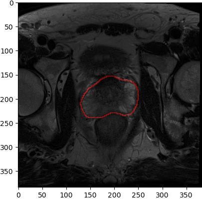

# ML_assesment

# Paper 1 (Nomogram):

Researched used a nomogram where information from a deep learning model imaging predictions (AlexNet and DenseNet, althought AlexNet had better performance and was eventually selected to be the architecture) , Prostate Imaging Reporting & Data System and clinical varibles (PCA, prostate volume and lesion volume) using multivariable logistic regression were used. Compared to other models that either use deep learning along with clinical or pi-rads score through the usage of AUC ( the area under the curve of ROC for diagnostic ability of a binary classifier) and other performence metrics such as Accuracy, Sensitivity and Specifity were used and performed better than PIN and DIN models. The ClaD nomogram yielded clinically significant results and could help identify patients with prostate cancer in varying levels of risk. 

# Paper 2 (Descriptor)

Researchers present a Prostate Surface Distension and Tumor Texture Descriptor system for BCR prediction. They observed that the shape descriptors were able to be used for a better prediction of the likely outcome of a disease and when used with texture features of PCA and radiomic texture (textural information of medical imaging) of prostate cancer allowed a better prediction of BCR. The descriptors were made through the reconstruction of T2-weighted MRI images, and descriptors were used for the training of a random forest for binary bcr prediction and texture radiomics classifier was also trained in a similar manner and subsequently used to train a linear regression model using prostate distension features. 
